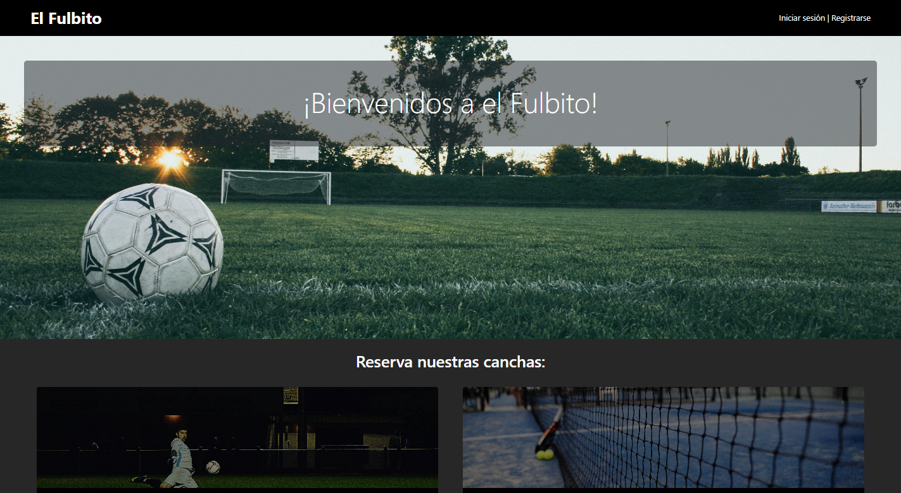

<h1 align="center">Sobre mi<a href="">.</a></h1>

Actualmente soy estudiante autodidacta de programación | Técnico en equipos e instalaciones electromecánicas | Estudiante de Ingeniería Civil | Buen manejo de matemáticas y estadísticas.

Mi enfoque principal es el desarrollo web backend, donde aplico mis conocimientos en Python, Flask, Django, bases de datos MySQL y gestión de APIs. También tengo experiencia en el uso de herramientas como Git y GitHub, y estoy familiarizado con HTML, CSS y Bootstrap para el diseño de Interfaces. Además, utilizo AWS, para la implementación y administración de servidores y bases de datos en la nube.
 

---

<h1 align="center">Conocimiento Técnico<a href="">.</a></h1>

---

<h1 align="center">Experiencia<a href="">.</a></h1>

<strong>Desarrollador Fullstack - Arte Sobre Blondas</strong>

  
- Desarrollo completo de un ecommerce para una tienda de cotillón, utilizando Python y Flask para el backend. HTML, Bootstrap, y personalizaciones adicionales con CSS para el frontend.
- Gestión de base de datos en MySQL para el manejo de productos, clientes y pedidos.
- Integración de la API de Mercado Pago (Checkout Pro) para procesar pagos de manera segura.
- Implementación de la API de Google Maps para facilitar la ubicación de la tienda y mejorar la experiencia del usuario.
- Control de versiones mediante Git y GitHub, asegurando un flujo de trabajo organizado.
- Despliegue del proyecto en AWS, utilizando EC2 para alojar el servidor y RDS para gestionar la base de datos.

<strong>Ayudante de Cátedra (Informática) - Facultad de Ingeniería, UNAM</strong>

- Colaboración en la enseñanza de lógica de programación utilizando Python.
- Soporte en el uso de hojas de cálculo en LibreOffice, abarcando funciones avanzadas y aplicaciones prácticas.
- Instrucción sobre conceptos de Internet, incluyendo protocolos HTTP, DNS y otras tecnologías relacionadas con redes.
- Apoyo a estudiantes en la resolución de problemas y en la comprensión de conceptos técnicos.
- Evaluación de trabajos y exámenes, proporcionando retroalimentación constructiva.

---

<h1 align="center">Proyectos<a href="">.</a></h1>

<h4></> Arte Sobre Blondas </h4>

**Tecnologías utilizadas:**
- **Backend:** Python (Flask)  
- **Base de Datos:** MySQL
- **APIS:** CheckoutPro (Mercado Pago), Google Maps
- **Cloud:** AWS (EC2 y RDS)
- **Control de versiones:** Git y GitHub
- **Frontend:** HTML, CSS, Bootstrap 

---

<h4></> Predio el Fulbito </h4>

**Tecnologías utilizadas:**
- **Backend:** Python (Django)  
- **Base de Datos:** MySQL
- **Control de versiones:** Git y GitHub
- **Deploy:** PythonAnywhere
- **Frontend:** HTML, CSS, Bootstrap  

<strong>Descripción del proyecto.</strong>

  
Este proyecto es una aplicación web para la gestión de reservas en un predio deportivo.
El predio cuenta con tres canchas:
- Dos canchas de Fútbol 5.
- Una cancha de Paddel.

Los usuarios pueden crear una cuenta, iniciar sesión y reservar las canchas en los horarios disponibles, también pueden cancelar sus reservas. De esta forma, el sistema facilita la organización de las reservas y permite un control eficiente de los horarios y la disponibilidad de las canchas.

---

<h1 align="center">Contacto<a href="">.</a></h1>

  
  

