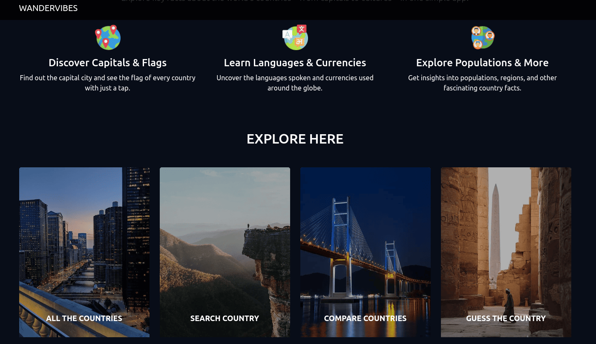

<h1 align="center">Sobre mi<a href="">.</a></h1>

Actualmente soy estudiante autodidacta de programación | Técnico en equipos e instalaciones electromecánicas | Estudiante de Ingeniería Civil | Buen manejo de matemáticas y estadísticas.

Mi enfoque principal es el desarrollo web backend, donde aplico mis conocimientos en Python, Flask, Django, bases de datos MySQL y gestión de APIs. También tengo experiencia en el uso de herramientas como Git y GitHub, y estoy familiarizado con HTML, CSS y Bootstrap para el diseño de Interfaces. Además, utilizo AWS, para la implementación y administración de servidores y bases de datos en la nube.
 

- [Ver y/o descargar CV](CV-Marcos-Malaquias-V.pdf)
- Email: malaquiazmarcos@gmail.com

---

<h1 align="center">Conocimiento Técnico<a href="">.</a></h1>

---

<h1 align="center">Experiencia<a href="">.</a></h1>

<strong>Desarrollador Fullstack - Arte Sobre Blondas</strong>

  
- Desarrollo completo de un ecommerce para una tienda de cotillón, utilizando Python y Flask para el backend. HTML, Bootstrap, y personalizaciones adicionales con CSS para el frontend.
- Gestión de base de datos en MySQL para el manejo de productos, clientes y pedidos.
- Integración de la API de Mercado Pago (Checkout Pro) para procesar pagos de manera segura.
- Implementación de la API de Google Maps para facilitar la ubicación de la tienda y mejorar la experiencia del usuario.
- Control de versiones mediante Git y GitHub, asegurando un flujo de trabajo organizado.
- Despliegue del proyecto en AWS, utilizando EC2 para alojar el servidor y RDS para gestionar la base de datos.

<strong>Ayudante de Cátedra (Informática) - Facultad de Ingeniería, UNAM</strong>

- Colaboración en la enseñanza de lógica de programación utilizando Python.
- Soporte en el uso de hojas de cálculo en LibreOffice, abarcando funciones avanzadas y aplicaciones prácticas.
- Instrucción sobre conceptos de Internet, incluyendo protocolos HTTP, DNS y otras tecnologías relacionadas con redes.
- Apoyo a estudiantes en la resolución de problemas y en la comprensión de conceptos técnicos.
- Evaluación de trabajos y exámenes, proporcionando retroalimentación constructiva.

---

<h1 align="center">Proyectos<a href="">.</a></h1>

⚠️ **IMPORTANTE:** Las imagenes son interactivas, al hacer clic accedés a la app para verla en vivo.

<h3></> Units Forge </h3>

<strong>Descripción del proyecto</strong>

  
Aplicación web interactiva desarrollada con React que consume mi propia API de conversión de unidades '[Units Forge](https://unitbridgeapi.pythonanywhere.com/)', creando un ecosistema completo de frontend y backend. El proyecto abarca múltiples categorías como longitud, peso, temperatura, volumen, área, tiempo, velocidad, etc.

La interfaz cuenta con un sistema de navegación por categorías, selectores dinámicos para elegir unidades de origen y destino, y conversiones bidireccionales en tiempo real mediante llamadas a la API. Incluye además una sección informativa con detalles sobre cada categoría de unidad disponible.

**Enfoque técnico y aprendizaje:**
- **Componentes reutilizables:** se desarrolló una arquitectura modular con componentes React separados por responsabilidad, facilitando el mantenimiento y escalabilidad del código.
- **Gestión de estado y peticiones:** implementación de hooks (useState, useEffect) para manejar el estado de las conversiones, llamadas asíncronas a la API y la navegación entre categorías.
- **Estilos modulares:** utilización de CSS Modules para encapsular estilos por componente, evitando conflictos y mejorando la organización del código.
- **Responsive design:**  diseño adaptativo que funciona correctamente en dispositivos móviles y desktop.

**Tecnologías utilizadas:**
- **Frontend:** React (JavaScript)
- **Backend:** API REST propia (Django - Python)
- **Estilos:** CSS Modules, Bootstrap
- **Librerías:** react-select  
- **Control de versiones:** Git y GitHub  
- **Deploy:** Vercel

***

<h3></> Unit Bride API </h3>

<strong>Descripción del proyecto</strong>

  
API desarrollada utilizando Django puro, sin herramientas como Django REST Framework. El objetivo principal del proyecto fue comprender en profundidad el funcionamiento de una API, construyéndola paso a paso de forma manual.

Permite convertir unidades de medida (longitud, peso, temperatura, etc.) a través de endpoints simples y claros. La documentación también fue construida manualmente con HTML, CSS y Bootstrap, ofreciendo una interfaz visual muy sencilla donde se explican las rutas disponibles y cómo interactuar con ellas.

**Enfoque técnico y aprendizaje:**
- **Validaciones y control de errores:** se implementó un sistema de validación para asegurar respuestas claras y coherentes ante entradas inválidas o solicitudes incorrectas.
- **Respuestas en formato JSON:** las respuestas fueron estructuradas manualmente, lo que permitió un control total sobre el contenido y el formato de salida.
- **Rate limiting con base de datos:** se utilizó el decorador `ratelimit` para limitar la cantidad de solicitudes por IP en un período determinado. Las peticiones se registran en una base de datos MySQL.
- **Registro de eventos (logging):** se integró el módulo `logging` de Python para registrar eventos importantes, facilitando la depuración y el monitoreo del sistema.

**Tecnologías utilizadas:**
- **Backend:** Django (Python)  
- **Base de datos:** MySQL (para caché de rate limit)  
- **Frontend de la documentación:** HTML, CSS, Bootstrap  
- **Control de versiones:** Git y GitHub  
- **Deploy:** PythonAnywhere

***

<h3></> WanderVibes </h3>

<strong>Descripción del proyecto</strong>

  
Aplicación web interactiva que consume la API de Rest Countries para mostrar información detallada de todos los países del mundo. Los usuarios pueden explorar datos como capital, población, idioma, moneda, banderas, entre otros,  además de comparar países y poner a prueba sus conocimientos geográficos.

**Enfoque técnico y mejoras:**
- **Documentación:** cada función y método está documentado con docstrings (estilo PEP 257), facilitando el mantenimiento y escalabilidad del código.

- **Optimización de API:**
  - Problema: algunas respuestas de la API eran demasiado grandes, causando lentitud.
  - Solución:
    - Filtrado de datos en el backend para solicitar solo campos necesarios.
    - Implementación de un sistema de cacheo manual: las respuestas de la API se guardan en archivos .json locales (simulando caché) y se reutilizan en consultas futuras si ya están disponibles.
  - Resultado: reducción significativa en el tiempo de carga y menor consumo de ancho de banda. La aplicación se mantiene rápida incluso en conexiones lentas.

- **Inglés:** interfaz y documentación realizadas completamente en inglés como parte de una práctica activa del idioma.

**Tecnologías utilizadas:**
- **Backend:** Django (Python)  
- **Interactividad:** AJAX (JavaScript) para evitar recargas en Guess Country
- **Control de versiones:** Git y GitHub
- **Deploy:** PythonAnywhere
- **Frontend:** HTML, CSS, Bootstrap  

***

<h3></> Predio el Fulbito </h3>

<strong>Descripción del proyecto</strong>

  
Este proyecto es una aplicación web para la gestión de reservas en un predio deportivo.
El predio cuenta con tres canchas:
- Dos de Fútbol 5.
- Una de Paddel.

Los usuarios pueden crear una cuenta, iniciar sesión y reservar las canchas en los horarios disponibles, también pueden cancelar sus reservas. De esta forma, el sistema facilita la organización de las reservas y permite un control eficiente de los horarios y la disponibilidad de las canchas.

**Tecnologías utilizadas:**
- **Backend:** Python (Django)  
- **Base de Datos:** MySQL
- **Control de versiones:** Git y GitHub
- **Deploy:** PythonAnywhere
- **Frontend:** HTML, CSS, Bootstrap

***

<h3></> Arte Sobre Blondas </h3>

**Tecnologías utilizadas:**
- **Backend:** Python (Flask)  
- **Base de Datos:** MySQL
- **APIS:** CheckoutPro (Mercado Pago), Google Maps
- **Cloud:** AWS (EC2 y RDS)
- **Control de versiones:** Git y GitHub
- **Frontend:** HTML, CSS, Bootstrap 

---

<h1 align="center">Contacto directo<a href="">.</a></h1>

  
  

